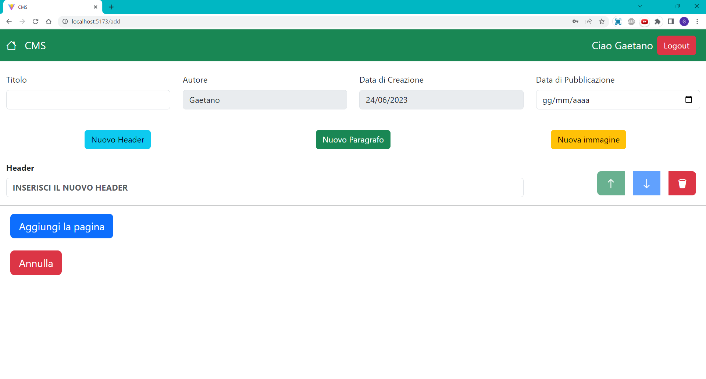
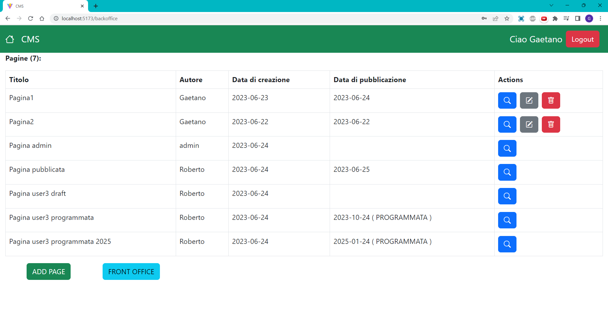

# Project: "CSM"
Project of the Web Application 1 course, made in javascript with the VsCode IDE. The goal of the project is to design and implement a web application to manage a small content management system (CMS). The project was made with the React framework, using React Bootstrap for styling and NodeJs as runtime environment. See Below for the Project Technical Description.

## ADD PAGE ALL'AVVIO PER UTENTE LOGGATO MA NON ADMIN


## BACKOFFICE PER UTENTE LOGGATO MA NON ADMIN


## React Client Application Routes
- Route `/`: pagina web principale frontoffice che mostra la lista di tutte le pagine pubblicate in ordine di data di pubblicazione
- Route `/backoffice`: pagina web del backoffice che mostra tutte le pagine di qualsiasi utente, disponibile solo da loggato.
- Route `/login`: pagina web contenente un form per effettuare il login
- Route `/pages/:pageId`: pagina dell'applicazione contenente blocchi di contenuto e informazioni di una particolare pagina. `:pageId` identifica la pagina da visualizzare.
- Route `/add`:pagina web contenente un form per aggiungere pagina e relativi blocchi di contenuto, disponibile solo da loggato.
- Route `/edit/:pageId`: pagina web contenente un form per editare pagina e relativi blocchi di contenuto, disponibile solo da loggato. `:pageId` identifica la pagina da editare.
- Route `/*`: route con messaggio di errore per routes non esistenti e link per tornare al front-office


## API Server
### API UTENTI
- POST `/api/sessions`
  - Descrizione: Crea una nuova sessione date le credenziali (non autenticata).

    Request body: username e password per effettuare il login (Content-Type: `application/json`).
    <details>
      <summary>Request Details</summary>
      
      ```
      {
        "username": "u3@p.it",
        "password": "pwd"
      }
      ```
    </details>

    Response: `200 OK` (success) o `401 Unauthorized` (error).

    Response body: username e password dell'utente che vuole loggarsi (Content-Type: `application/json`).
    <details>
      <summary>Response Details</summary>

      ```
      {
        "id": 3,
        "email": "u3@p.it",
        "username": "user3",
        "isAdmin": 0
      }
      ```
    </details>
- GET `/api/sessions/current`
  - Descrizione: Verifica che una sessione è ancora valida e ritorna le informazioni sull'utente loggato. Deve essere fornito un cookie con un VALID SESSION ID.

    Request body: _None_ 

    Response: `200 OK` (success) o `401 Unauthorized` (error).

    Response body: user information of the current logged in user (Content-Type: `application/json`).
    <details>
      <summary>Response Details</summary>

      ```
      {
        "id": 3,
        "email": "u3@p.it",
        "username": "user3",
        "isAdmin": 0
      }
      ```
    </details>
- DELETE `/api/session/current`
  - Descrizione: Elimina la sessione corrente.   - Descrizione: Verifica che una sessione è ancora valida e ritorna le informazioni sull'utente loggato. 

    Request body: _None_

    Response: `200 OK` (success).

    Response body: _None_
- GET `/api/users`
  - Descrizione: Restituisce tutti gli utenti dell'applicazione. Deve essere fornito un cookie con un VALID SESSION ID.

    Request body: _None_ 

    Response: `200 OK` (success) o `401 Unauthorized` o `403 Forbidden` (permission error) o `500 Internal Server Error` (generic error).

    Request body: _None_
    <details>
      <summary>Response Details</summary>

      ```
      [{
        "id": 1,
        "username": "user1",
        "isAdmin": 0,
      },
      {
        "id": 2,
        "username": "user2",
        "isAdmin": 1
      },
      ...
      ]
      ```
    </details>
### API PAGINE
- GET `/api/pages/frontoffice`
  - Descrizione: Get delle sole pagine pubblicate in ordine di data di pubblicazione per la visualizzazione frontoffice(autenticazione non richiesta).

    Request body: _None_

    Response: `200 OK` (success) o `500 Internal Server Error` (generic error).

    Response body: Un array di oggetti, ognuno con le informazioni di una pagina.
    <details>
      <summary>Response Details</summary>

      ```
      [{
        "id": 65,
        "autore": "user2",
        "autoreId": 2,
        "titolo": "PUBBLICATA",
        "dataCreazione": "2023-06-22",
        "dataPubblicazione": "2023-06-22"
      },
      ...
      ]
      ```
    </details> 
- GET `/api/pages/backoffice`
  - Descrizione: Get di tutte le pagine create per la visualizzazione backoffice(AUTENTICATA).

    Request body: _None_

    Response: `200 OK` (success) o `500 Internal Server Error` (generic error).

    Response body: Un array di oggetti, ognuno con le informazioni di una pagina.
    <details>
      <summary>Response Details</summary>

      ```
      [{
        "id": 75,
        "autore": "user3",
        "autoreId": 3,
        "titolo": "NON PUB",
        "dataCreazione": "2023-06-24",
        "dataPubblicazione": "2023-06-29"
      },
      ...
      ]
      ```
    </details> 
- GET `/api/pages/frontoffice/:id`
  - Descrizione: Get di una singola pagina (pubblicata) identificata da `<id>`. Permette la visualizzazione delle informazioni piu' il contenuto della pagina per il frontoffice(autenticazione non richiesta).

    Request body: _None_

   Response: `200 OK` (success) o `403 Forbidden` (error) o `404 Not Found` (not found error) o `422 Unprocessable Entity` (semantic error)  o `500 Internal Server Error` (generic error).

    Response body: Un oggetto che descrive la pagina con un array di blocchi per ogni contenuto della pagina (Content-Type: `application/json`).
    <details>
      <summary>Response Details</summary>

      ```
      {
        "id": 78,
        "autore": "user3",
        "autoreId": 3,
        "titolo": "Pagina con header e immagine",
        "dataCreazione": "2023-06-24",
        "dataPubblicazione": "2023-06-24",
        "blocchi": [
          {
            "id": 466,
            "paginaId": 78,
            "tipo": "header",
            "contenuto": "Header della pagina",
            "posizione": 0
          },
          {
            "id": 467,
            "paginaId": 78,
            "tipo": "immagine",
            "contenuto": "Pizza.jpg",
            "posizione": 1
          }
        ]
      }
      ```
    </details>
- GET `/api/pages/backoffice/:id`
  - Descrizione: Get di una qualsiasi pagina identificata da `<id>`. Permette la visualizzazione delle informazioni piu' il contenuto della pagina per il backoffice(AUTENTICATA).

    Request body: _None_

   Response: `200 OK` (success) o  `401 Unauthorized` (error)  o `404 Not Found` (not found error) o `422 Unprocessable Entity` (semantic error)  o `500 Internal Server Error` (generic error).

    Response body: Un oggetto che descrive la pagina con un array di blocchi per ogni contenuto della pagina (Content-Type: `application/json`).
    <details>
      <summary>Response Details</summary>

      ```
      {
        "id": 78,
        "autore": "user3",
        "autoreId": 3,
        "titolo": "Pagina con header e immagine",
        "dataCreazione": "2023-06-24",
        "dataPubblicazione": "2023-06-24",
        "blocchi": [
          {
            "id": 466,
            "paginaId": 78,
            "tipo": "header",
            "contenuto": "Header della pagina",
            "posizione": 0
          },
          {
            "id": 467,
            "paginaId": 78,
            "tipo": "immagine",
            "contenuto": "Pizza.jpg",
            "posizione": 1
          }
        ]
      }
      ```
    </details>
- POST `/api/pages`
- Descrizione: Crea una nuova pagina e i relativi blocchi(AUTENTICATA).

    Request body:Un oggetto che rappresenta la pagina con dentro un array di blocchi (Content-Type: `application/json`).
    <details>
      <summary>Request Details</summary>

      ```
      {
          "titolo": "Pagina con contenuto",
          "dataPubblicazione":"2023-06-24",
          "dataCreazione":"2023-06-24",
          "autoreId": 3,
          "blocchi":[{
              "tipo":"header",
              "contenuto":"Header della pagina ",
              "posizione":0
          },{
              "tipo":"immagine",
              "contenuto":"Pizza.jpg",
              "posizione":1
          }
          ]
      }
      ```
    </details>

    Response: `201 OK` (success) o `401 Unauthorized` (error) o `403 Forbidden` (error) o `404 Not Found` (not found error) o `422 Unprocessable Entity` (semantic error) o `503 Service Unavailable` (Unavailability error) .

    Response body: L'id della pagina creata.
    <details>
      <summary>Response Details</summary>

      ```
        79
      ```
    </details>
- POST `/api/pages/:id`
  - Description: Aggiorna una pagina identificata da `<id>`.(AUTENTICATA)

    Request body: Un oggetto contenente le info della pagina e i relativi blocchi(Content-Type: `application/json`).
    <details>
      <summary>Request Details</summary>

      ```
      {
        "titolo": "Pagina pubblicata",
        "autoreId": 2,
        "dataPubblicazione":"2023-08-21",
        "dataCreazione":"2023-06-22",

        "blocchi":[{
            "tipo":"header",
            "contenuto":"Contenuto dell'header",
            "posizione":0
        },{
            "tipo":"immagine",
            "contenuto":"Pizza.jpg",
            "posizione":1
        }
        ]
      }
      ```
    </details>

    Response: `201 OK` (success) or `401 Unauthorized` (error) or `403 Forbidden` (error) or `404 Not Found` (not found error) or `422 Unprocessable Entity` (semantic error) or `503 Service Unavailable` (Unavailability error).


    Response body: id della pagina aggiornata.
    <details>
      <summary>Response Details</summary>

      ```
      71
      ```
    </details>
- DELETE `/api/pages/:id`
  - Description: Cancella una pagina, identificata da `<id>`.(AUTENTICATA)

    Request body: _None_

    Response: `200 OK` (success) o `401 Unauthorized` (error) o `403 Forbidden` (error) o `404 Not Found` (not found error) or `422 Unprocessable Entity` (semantic error) o `503 Service Unavailable` ( error)  .

    Response body: {}

### API NOME DEL SITO
- GET `/api/sitename`
  - Descrizione: Get per il nome del sito web (autenticazione non richiesta).

    Request body: _None_

    Response: `200 OK` (success) o `500 Internal Server Error` (generic error).

    Response body: Un oggetto contenente il nome del sito (Content-Type: `application/json`).
    <details>
      <summary>Response Details</summary>
      
      ```
      {
        "nomesito": "CMS"
      }
      ```
- PUT `/api/sitename`
  - Descrizione: Aggiorna il nome del sito con il nuovo nome.(AUTENTICATA)

      <details>
      <summary>Request body Details</summary>
      
      ```
        {
            "sitename": "CMS aggiornato"
        }
      ```
      </details>

    Response: `200 OK` (success) o `401 Unauthorized` (error) o `403 Forbidden` (error) o `404 Not Found` (not found error) o `422 Unprocessable Entity` (semantic error) o `503 Service Unavailable` (Database error).

    Response body: Il numero di righe modificate, cioè 1 (Content-Type: `application/json`).
    <details>
      <summary>Response Details</summary>

      ```
      1
      ```
    </details> 
### API IMMAGINI
- GET `/api/images`
  - Description: Get di tutte le immagini presenti nella cartella statica filtrate in base all'estensione (autenticazione non richiesta).

    Request body: _None_

    Response: `200 OK` (success) o `500 Internal Server Error` (generic error)..

    Response body: Un oggetto contente l'array con i nomi delle immagini (Content-Type: `application/json`).
    <details>
      <summary>Response Details</summary>

      ```
      {
        "images": [
          "Gattino.jpg",
          "Napoli.jpeg",
          "Pizza.jpg",
          "Tramonto.jpg"
      ]
      }

      ```
    </details> 


## Database Tables

- Tabella `utenti` - (id, username, email, hash, salt, isAdmin)
    <details>
      <summary>Utenti Details</summary>
        Serve a memorizzare le informazioni sugli utenti registrati, compresa l'info per vedere se un utente è admin o no
      </details> 
- Tabella `pagine` - (id, autoreId, titolo, dataCreazione, dataPubblicazione)
    <details>
      <summary>Pagine Details</summary>
        Serve a memorizzare le informazioni sulle pagine create (blocchi di contenuto esclusi)
      </details> 
- Tabella `sito` - (nomesito)
    <details>
      <summary>Sito Details</summary>
        Serve a memorizzare lil nome del sito corrente
      </details> 
- Tabella `blocchi` - (id, paginaId, tipo, contenuto, posizione)
    <details>
      <summary>Blocchi Details</summary>
        Serve a memorizzare le informazioni sui blocchi di contenuto, ognuno ha un vincolo di integrità referenziale con una pagina.
      </details> 

## Main React Components

- `MyNavbar` (in `components/utility.jsx`): navbar usata per mostrare il nome del sito, con logica per modificare lo stesso, e info sull'utente 
- `PagesList` (in `components/PagesList.jsx`): componente usato per mostrare la lista delle pagine (pubblicate nel frontoffice e tutte nel backoffice)
- `PageRow` (in `components/PagesList.jsx`):  componente usato per mostrare la singola pagina nella lista delle pagine (pubblicate nel frontoffice e tutte nel backoffice)
- `LoginForm` (in `components/LoginForm.jsx`): componente usato per mostrare il form del login
- `PageForm` (in `components/PageForm.jsx`): componente usato per mostrare la pagina nel dettaglio oppure il form per edit/add


## Users Credentials 

| email | password |username| other_info | 
|------------------|----------|----------|-------------|
|u1@p.it|pwd|Gaetano|user autore di 2 pagine, pubblicate entrambe|
|u2@p.it|pwd|admin|user con i permessi da admin autore di 1 pagina draft|
|u3@p.it|pwd|Roberto|user autore di 1 pubblicata, 1 draft e 2 programmate|
|u4@p.it|pwd|user4|user che non ha mai creato pagine 

